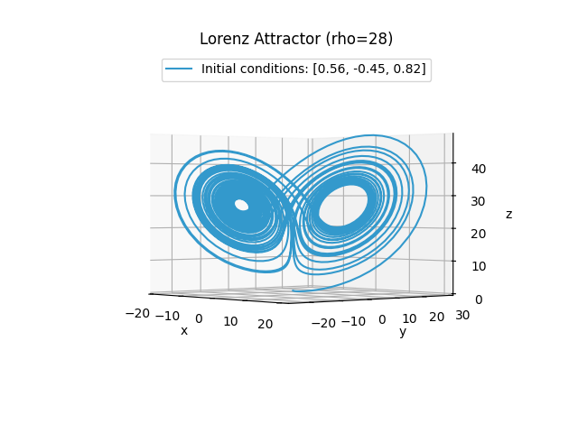
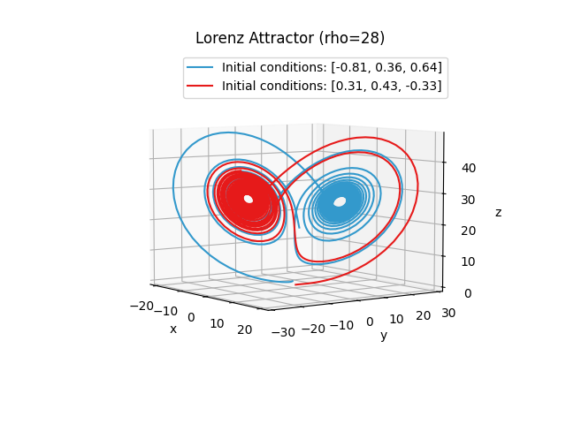
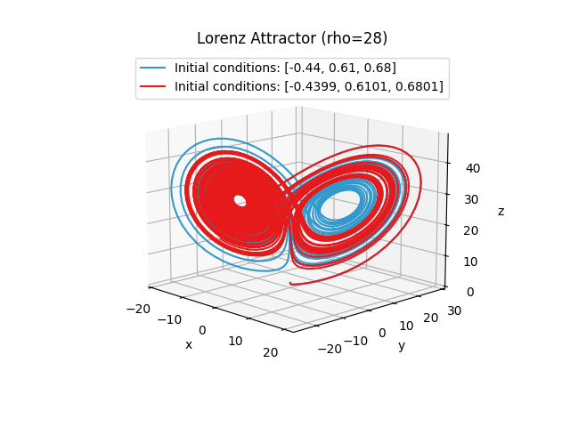
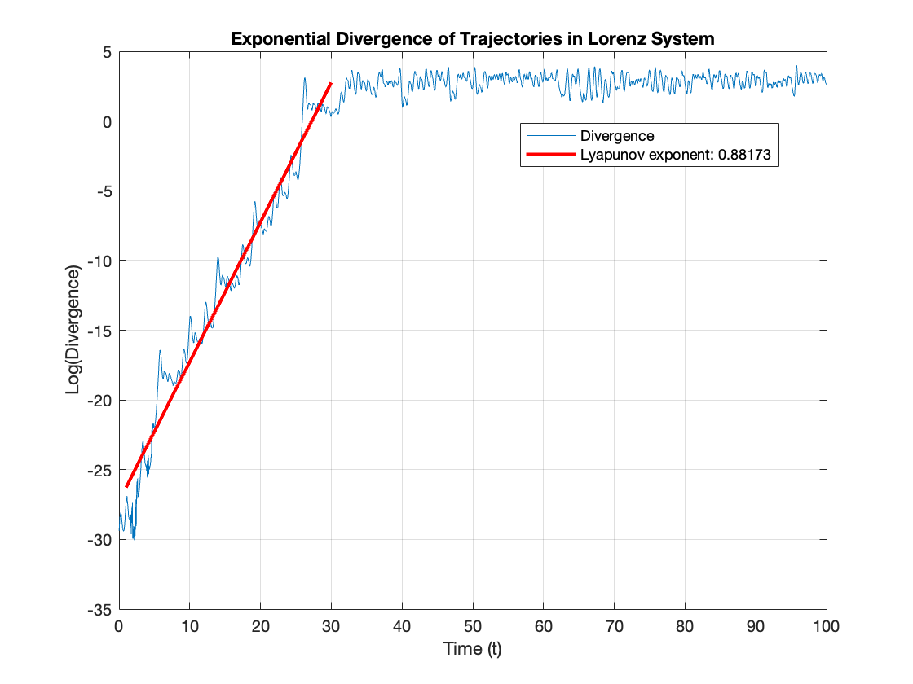
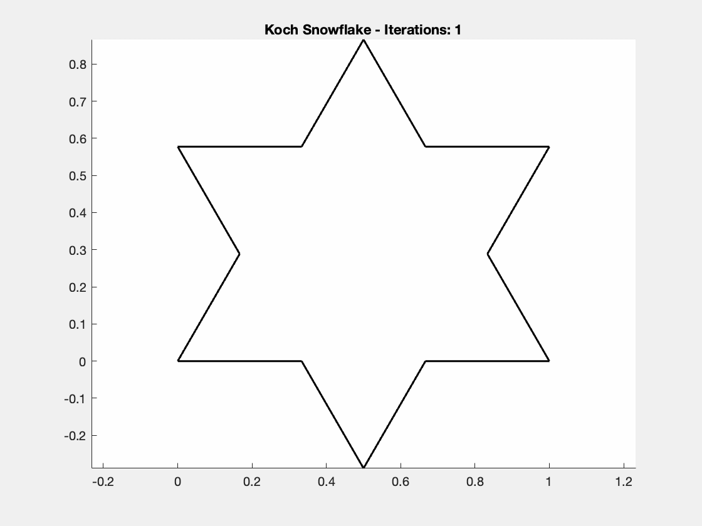
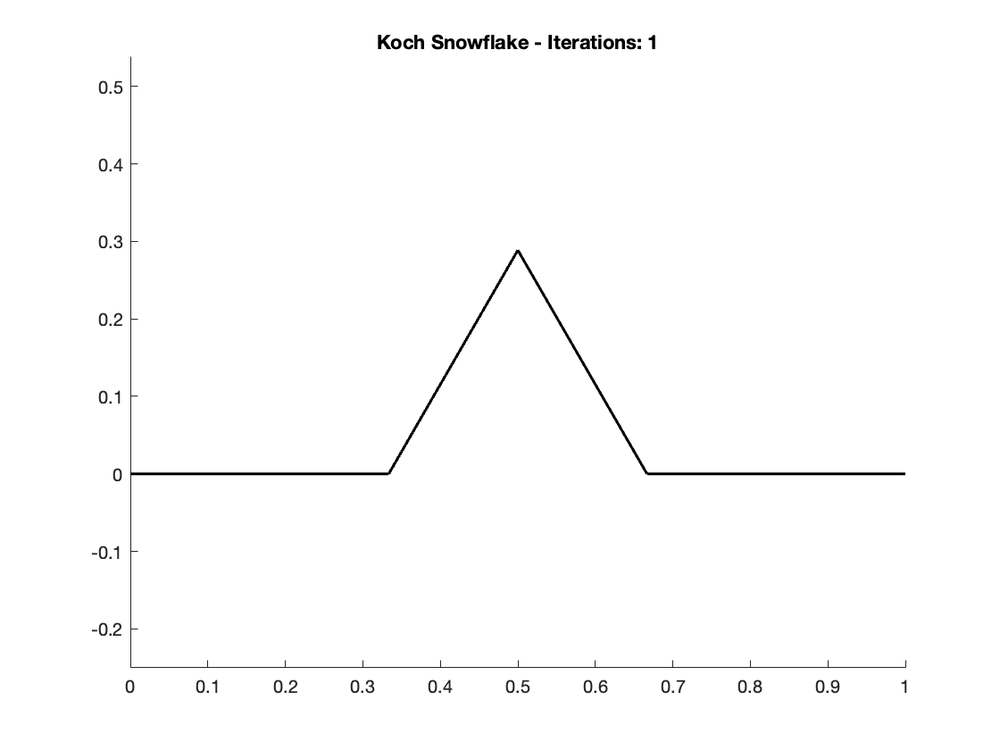
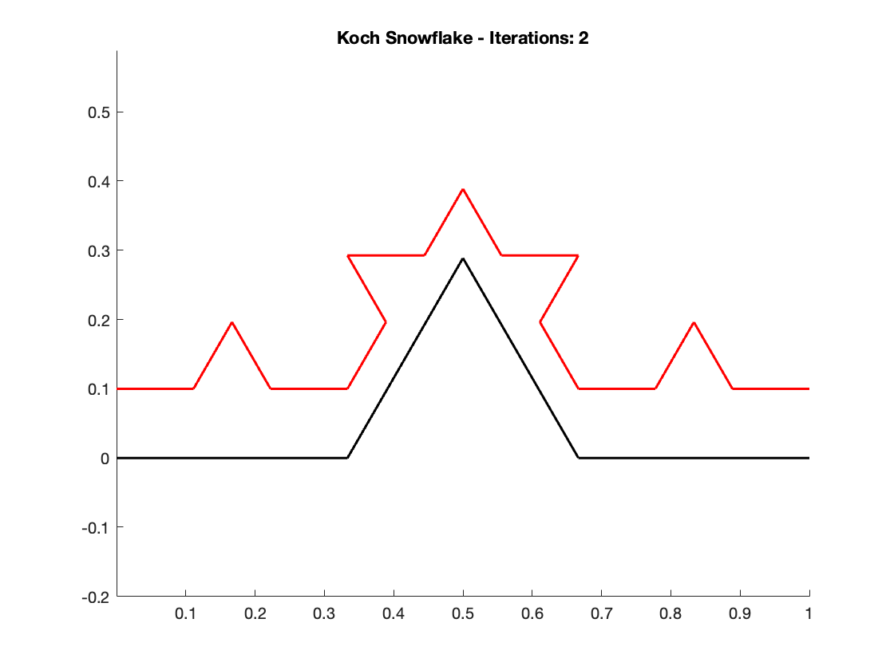
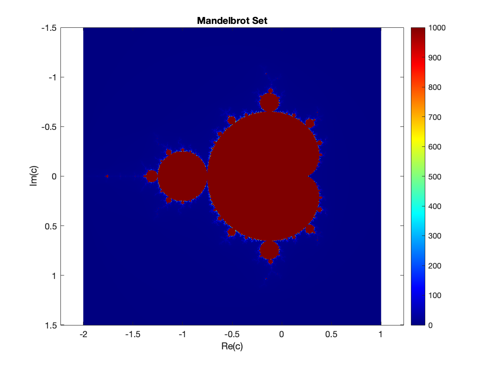

# 🚀 Nonlinear Dynamics & Chaos Simulations

A compilation of numerical simulations relating to Nonlinear Dynamics & Chaos. I started these in my physics class with the same name, and since then have continued some simulations and am in the process of adapting them to python.

## 🛠️ Simulations

- 📄 [`lorenz_attractor.py`](source/lorenz_attractor.py) - Simulation of the Lorenz Attractor, or Lorenz Butterfly, one of the most classic examples of chaos
- 📄 [`koch_snowflake.m`](source/koch_snowflake.m) - Simulation of images/gifs of the Koch Snowflake, a simple example of self similarity
- 📄 [`LorenzBoxCounting.m`](source/LorenzBoxCounting.m) - A script to count the correlation dimension
- 📄 [`LogisticMap.m`](source/LogisticMap.m) - A bifurcation diagram for the logistic map equation, an example of how quickly non-linear systems can go from simple to chaotic, and a more complex example of self similarity

## Visuals

### 🦋 Lorenz Butterfly

<div align="center">
    <br />
    A Mathematical Butterfly: Simulating the Lorenz Attractor
    <br />
    <br />
    Two different random initial conditions end up on the same "strange attractor"
    <br />
    
    <br />
    Chaos: An Exponential Divergence of Initial Conditions
    <br />

</div>

Two nearly identical initial conditions in the Lorenz system (colored trajectories) start close together but rapidly separate over time. This striking demonstration of sensitive dependence on initial conditions — colloquially known as the Butterfly Effect — illustrates how infinitesimal disturbances lead to exponentially different outcomes in chaotic systems.

The right plot explicitly shows the exponential divergence of chaos, plotting the log of the distance between the two over time until they reach the bounds of the lorenz attractors' phase space. The slope of this line, called the **Lyapunov Exponent** is calculated to be 0.88, a 2% error from the typically accepted value of 0.9.

### ❄️ Koch Snowflake



One of the most classic examples of fractals - or fractional dimensions. A process of self similarity occurs, where after one iteration each line turns into the initial configuration of 4 lines shown here:

<div align="center">
    
    
</div>

So, what is the dimension of the Koch snowflake? At first glance it seems to be 1D, it is a line after all. However, as the number of iterations increases, the length of the snowflake becomes infinitely long. However, it feels wrong to say that the snowflake is 2D, especially when looking at only the one arc.

To solve this problem, we introduce the _*similarity dimension (d)*_ - a measure of the dimension of self similar objects.

$$ d = \dfrac{\ln{m}}{\ln{r}} $$

Where _*m*_ is the number of copies of the original and _*r*_ is the amount it is scaled down for each iteration. In this case, at each iteration the original image is scaled down by 3 and there are 4 copies of the original.

Using this, we can calculate the dimension of the Koch snowflake to be
$$ d = \dfrac{\ln{4}}{\ln{3}} \approx 1.27$$
which is more than 1 and less than 2, as expected.

### Mandelbrot Set



_Coming soon..._

<!-- ## 📖 Usage

```matlab
% Example of running a script
script1;
``` -->
